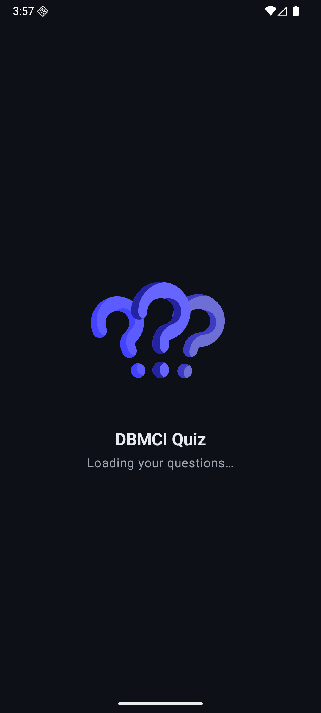
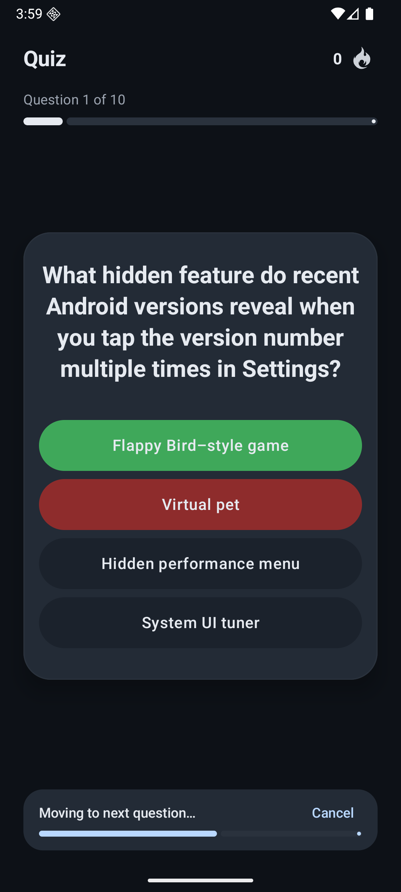
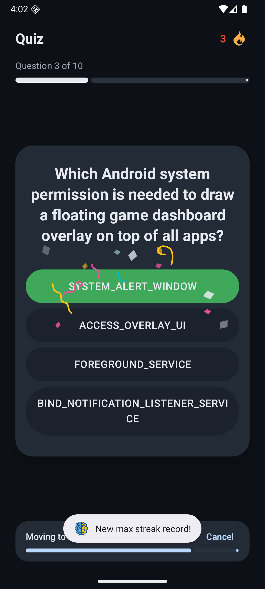
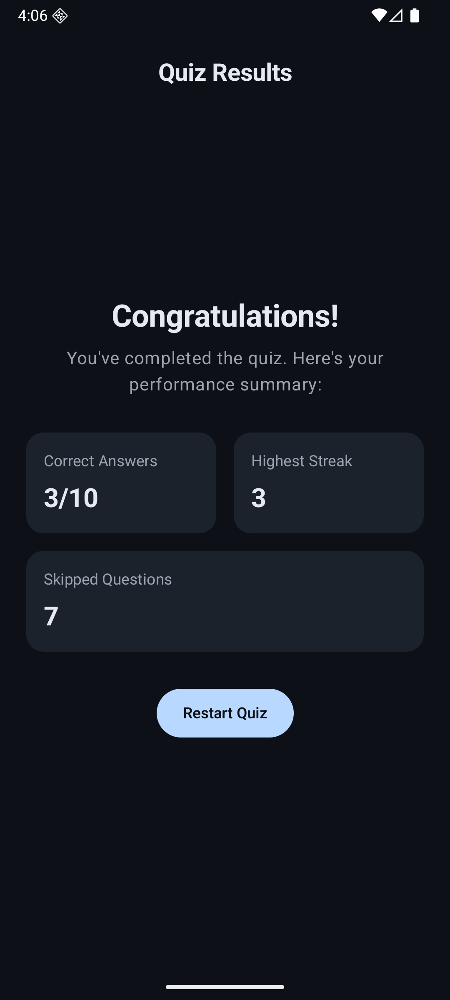
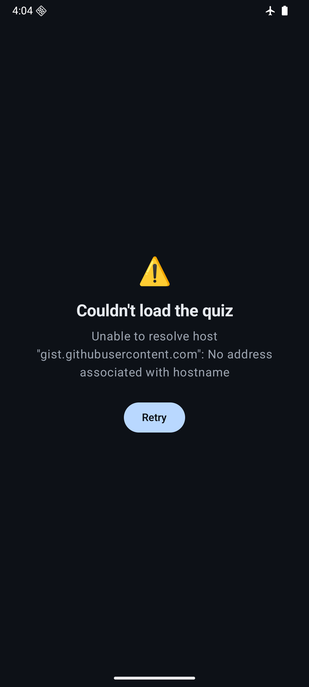
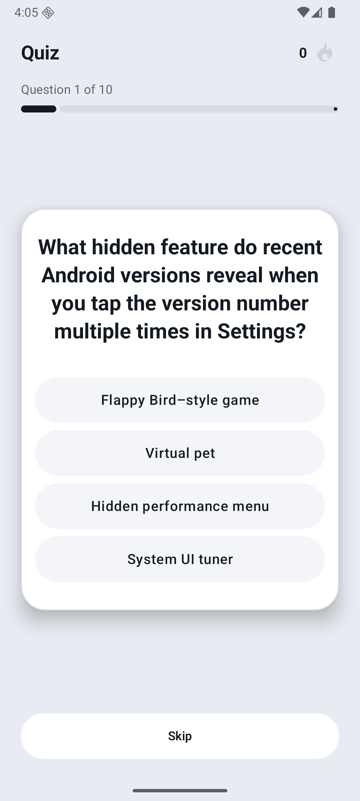
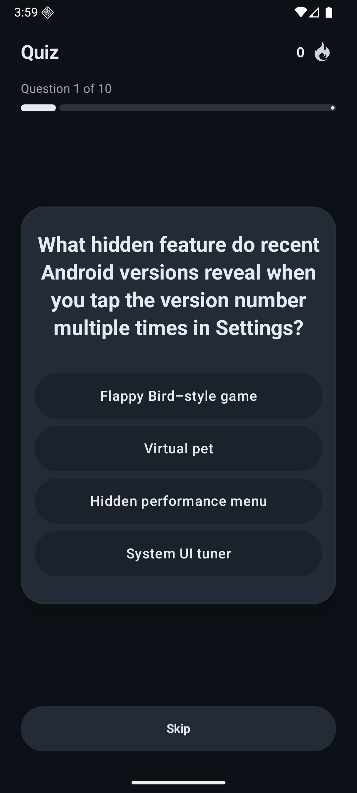

# DBMCI Quiz

An Android quiz app built with Jetpack Compose. It loads ten questions from a remote endpoint,
reveals the correct answer the moment you tap, keeps track of how many you get right in a row, and
shows a summary at the end. It works in both light and dark mode, and you can move between questions
by swiping the card as well as tapping.

## Demo

Video walkthrough: https://drive.google.com/drive/folders/1ELupg7f941ykqRyVRc5HKEQy6iPaL-gy?usp=sharing

## Screenshots

| Splash | Quiz | Answer reveal |
| :--: | :--: | :--: |
|  |  |  |

| Streak celebration | Results | Error state |
| :--: | :--: | :--: |
|  |  |  |

The theme follows the system setting:

| Light | Dark |
| :--: | :--: |
|  |  |

## What it does

- Loads a set of questions from a GitHub Gist over the network, and keeps them in memory so it
  doesn't refetch on the way back.
- Shows a loading splash while the questions arrive, and an error screen with a Retry button if the
  request fails.
- Locks a question as soon as you answer, marking the correct option green and a wrong choice red.
- Counts consecutive correct answers as a streak. A wrong answer or a skip resets it, and reaching a
  new best of three or more plays a short celebration.
- Moves to the next question on its own after two seconds, with a Cancel option — or you can move
  yourself, either with the button or by swiping the card to the left.
- Ends on a summary of correct answers, best streak, and skipped questions, with a button to start
  over.

## Tech

- Kotlin, Jetpack Compose, Material 3
- MVVM with a repository; UI state exposed as `StateFlow`
- Navigation Compose for the quiz and result screens
- Retrofit and kotlinx.serialization for the network layer
- Coroutines and Flow for async work
- Lottie for the splash, streak, and celebration animations
- Min SDK 29, target SDK 36

## How it's put together

The code is split into a data layer and a view layer. The data layer fetches the questions and maps
them to a domain model; the view layer holds the screens and a ViewModel that owns their state.
State moves in one direction: the ViewModel exposes `StateFlow`s, the UI reads them, and the UI calls
back into the ViewModel when something happens.

```
Remote JSON -> QuizService (Retrofit) -> QuestionDto -> toDomain() -> Question
                                                                        |
                                          QuizRepository (in-memory cache)
                                                        |
                                          QuizViewModel  --StateFlow-->  Compose UI
                                                        ^                    |
                                                        +------ events ------+
```

A few decisions worth calling out:

- The repository caches questions after the first successful load, but a failed load isn't cached, so
  Retry still works.
- Loading, success, and error are modelled with a small `DataState` type that drives the switch
  between the splash, quiz, and error screens.
- The quiz's in-progress state — current question, selected option, streak, and the auto-advance
  and celebration flags — is a single `QuizUiState` object, kept separate from that load state.
- The `QuizViewModel` is tied to the quiz screen's navigation entry, so restarting the quiz gives you
  a fresh one with no manual reset. The final scores are passed to the results screen as navigation
  arguments.
- Colour, type, and spacing live in a small set of theme tokens so the UI stays consistent.

```
app/src/main/java/com/example/dbmciquiz/
├── MainActivity.kt
├── data/
│   ├── model/Question.kt                 # domain model
│   ├── remote/
│   │   ├── NetworkModule.kt              # Retrofit + JSON setup
│   │   ├── QuizService.kt                # API endpoint
│   │   └── QuestionDto.kt                # wire model + toDomain()
│   └── repository/QuizRepository.kt      # data source + cache
└── view/
    ├── QuizApp.kt                        # navigation host
    ├── DataState.kt                      # Loading / Success / Failure
    ├── component/                        # reusable UI pieces
    │   ├── Animations.kt
    │   ├── LottiePlayer.kt
    │   └── SwipeToSkipCard.kt
    ├── screen/
    │   ├── SplashScreen.kt
    │   ├── ErrorScreen.kt
    │   ├── ResultScreen.kt
    │   └── quiz/
    │       ├── QuizScreen.kt
    │       ├── QuizViewModel.kt
    │       ├── OptionPill.kt
    │       ├── AutoAdvanceBar.kt
    │       └── StreakIcon.kt
    └── theme/                            # colour, type, spacing
```

## Running it

You'll need Android Studio and a device or emulator on API 29 or newer.

```bash
git clone <your-repo-url>
cd DBMCIQuiz
```

Open the project in Android Studio and press Run, or build from the terminal:

```bash
./gradlew installDebug
```

There's nothing to configure — the questions come from a public GitHub Gist.
